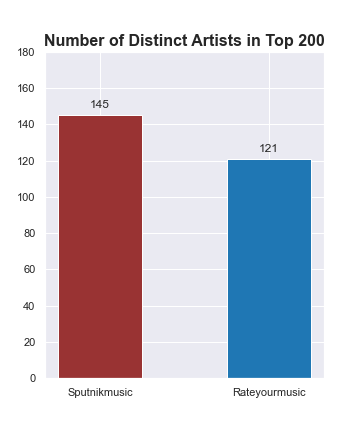

# Top Rated Albums of All Time: Project Overview
* Discovered differences between two popular music rating websites: sputnikmusic.com and rateyourmusic.com in terms of genre preferences and popularity of certain artists
* Scraped data from the top 200 albums of all time lists from both websites using python and selenium
* Cleaned and restructured the data before inserting into a MySQL database
* Created SQL views in order to easily extract the data from the database for analysis
* Created visualizations from the data using the matplotlib library in order to compare and analyze the data from both sites

# Code and Packages Used
**Python Version:** 3.8  
**Packages:** pandas, matplotlib, seaborn, beautifulsoup4, selenium, sqlalchemy, requests, numpy  
**MySQL Version:** 8.0.21

# Web Scraping
Scraped the data from the top 200 albums of all time page for each respective site. To do this, I used Python's BeautifulSoup package, Selenium webdriver, and the standard requests library. For each album the following data was collected:
* Ranking
* Artist
* Album Name
* Score
* Number of Ratings
* Release Year
* Genre(s)

The data was then cleaned and transformed in order to handle between 1 and 3 genres for each album. The data was then inserted into a MySQL database in two separate tables, one for each site.

# Data Visualization
Some charts created from the collected data:

# Analysis & Insights
I found several different useful insights from this analysis. Firstly, it is fair to say that Sputnikmusic does tend to rank certain genres higher than Rateyourmusic, most notably Metal and Soundtracks. For Metal, this is particulary apparent when comparing extreme and progressive metal albums released in the 1990's. The Sputnik rankings contain 27 albums which fit this criteria while RYM only has 5. Meanwhile RYM tends to rank Pop albums much higher overall than Sputnik. RYM's ranking contains 60 such albums, while Sputnik's contains only 23. These differences aside however, it can be said that both sites rank a multitude of different genres very highly, so most music enthusiasts will find something to love from both. 

Both sites have a remarkably similar median release year for their rankings (1986 for Sputnik, 1985 for RYM), showing that both sites contain a fairly balanced distribution of albums released throughout the decades. The only reason for a significant difference in the mean is that Sputnik includes Classical albums released in the 18th and 19th centuries while RYM does not.

Another interesting difference between the sites is that Sputnik contains over 20 more distinct artists in its rankings. This suggests that Sputnik contains many more 'underground' artists and bands, while some popular artists have many different albums represented in RYM's top 200, most noticeably Radiohead. This could simply be due to the fact that RYM includes popularity as a factor into its rankings.

The takeaway for any music fan who may be considering which site they would enjoy more, is that both sites are worth frequenting. However, those who are more interested in Metal and finding more 'underground' music may enjoy their time on Sputnik more. Meanwhile those more interested in more Pop and Rock albums and perhaps a cleaner website (sorry Sputnik), many want to spend more time on RYM.
